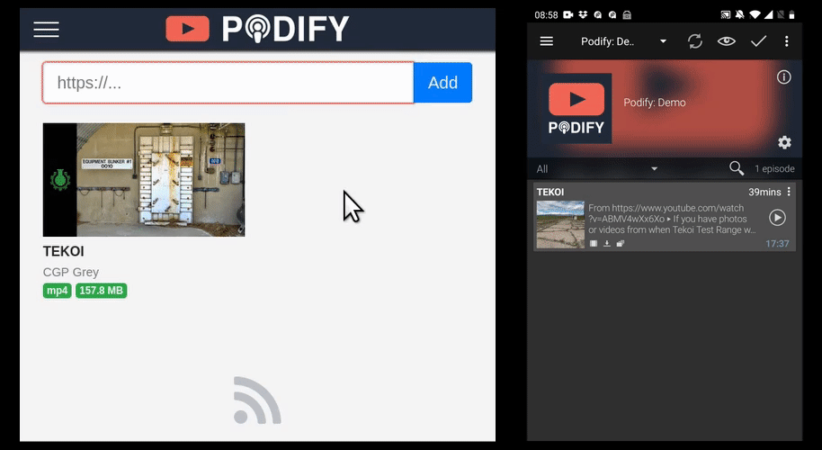

# Podify


Create podcasts from anything youtube-dl can handle.



Podify is a self-hosted service that allows you to download videos and audio from any source supported by [youtube-dl](https://github.com/layer8x/youtube-dl.rb), sort the downloads into feeds, and subscribe to these feeds using your favorite podcast app (I recommend [Podcast Addict](https://play.google.com/store/apps/details?id=com.bambuna.podcastaddict&hl=en) if you're on Android).

## Installation using Docker

Here's a [sample `docker-compose.yml`](docker/docker-compose.example.yml).

## Configuration via Environment Variables

| Variable              | Required | Description                                                                                           |
|:----------------------|:---------|:------------------------------------------------------------------------------------------------------|
| DATABASE_URL          | Yes      | `postgres://` url pointing to postgres database                                                       |
| REDIS_URL             | Yes      | `redis://` url pointing to redis instance                                                             |
| URL_HOST              | Yes      | Where the app will be available, e.g. `https://podify.yourdomain.com`                                 |
| SECRET_KEY_BASE       | Yes      | This is used to encrypt sessions, see [below](#secret_key_base)                                       |
| STORAGE_DIR           | Yes      | Where downloads will be stored                                                                        |
| INITIAL_USER_EMAIL    | No       | Email of user to create at startup                                                                    |
| INITIAL_USER_PASSWORD | No       | Password of user to create at startup                                                                 |
| ENABLE_SIGNUP         | No       | Allow anyone with access to the site to sign up. `"yes"` or `"no"` (default: `"yes"`)                 |

### `SECRET_KEY_BASE`

This is utilized to encrypt and sign sessions. It's recommended that you generate a new one instead of using the one from the example `docker-compose.yml`. You can generate a new one using

    docker run --rm maxhollmann/podify rails secret

## Development

```shell
docker compose -f dev-env/docker-compose.yml up
bundle install
yarn install

bundle exec sequel -m db/migrate postgres://podify@localhost/podify_development
bundle exec sequel -m db/migrate postgres://podify@localhost/podify_test

bin/webpack-dev-server
bundle exec rails s
bundle exec sidekiq
```

If you have [tmux](https://github.com/tmux/tmux/wiki) and [tmuxp](https://tmuxp.git-pull.com/) installed you can start all required services by running `dev-env/up`.
